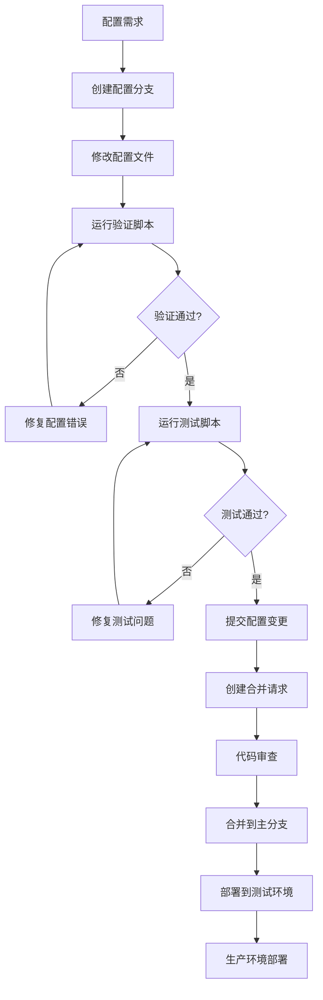
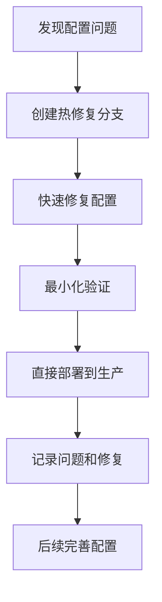
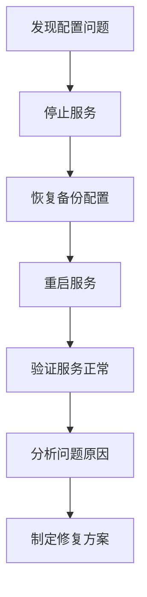

# 怪物配置管理工具说明

## 现有工具介绍

### 1. merge_config.py - 配置合并工具

这个工具用于将分散的配置文件合并成统一的配置格式。

#### 功能特点：
- 将多个配置文件合并为一个
- 支持配置文件的预处理
- 生成统一的配置输出

#### 使用方法：
```bash
python merge_config.py
```

#### 输出文件：
- 合并后的配置文件
- 处理日志

### 2. split_config.py - 配置分割工具

这个工具用于将大型配置文件分割成多个小文件，便于管理和维护。

#### 功能特点：
- 按配置类型分割文件
- 保持配置的完整性
- 生成分割后的文件结构

#### 使用方法：
```bash
python split_config.py
```

#### 输出目录：
- `split_configs/` - 分割后的配置文件目录

## 配置管理最佳实践

### 1. 版本控制策略

#### Git工作流
```bash
# 创建配置分支
git checkout -b monster-config-update

# 修改配置文件
# ... 进行配置修改 ...

# 提交更改
git add .
git commit -m "更新怪物配置：添加新Boss"

# 推送到远程仓库
git push origin monster-config-update

# 创建合并请求
```

#### 配置变更记录
```markdown
## 配置变更日志

### 2024-01-15
- 添加新Boss：祖玛教主 (ID: 100)
- 修改鸡的属性配置
- 更新AI行为参数

### 2024-01-10
- 修复掉落配置错误
- 优化对话触发频率
```

### 2. 配置验证流程

#### 自动化验证脚本
```python
#!/usr/bin/env python3
# config_validator.py

import json
import os

def validate_monster_config():
    """验证怪物配置的完整性"""
    errors = []
    
    # 检查Monster.config
    monster_config = load_config('data/config/monster/Monster.config')
    props_config = load_config('data/config/monster/Props.config')
    flags_config = load_config('data/config/monster/Flags.config')
    ai_config = load_config('data/config/monster/AI.config')
    
    for monster_id, monster in monster_config.items():
        # 验证AI配置引用
        if monster['aiConfigId'] not in ai_config:
            errors.append(f"怪物 {monster_id} 引用了不存在的AI配置 {monster['aiConfigId']}")
        
        # 验证属性配置引用
        if monster['propid'] not in props_config:
            errors.append(f"怪物 {monster_id} 引用了不存在的属性配置 {monster['propid']}")
        
        # 验证标志配置引用
        if monster['flagid'] not in flags_config:
            errors.append(f"怪物 {monster_id} 引用了不存在的标志配置 {monster['flagid']}")
    
    return errors

def validate_numeric_ranges():
    """验证数值范围"""
    errors = []
    
    # 检查等级范围
    for monster_id, monster in monster_config.items():
        if not (1 <= monster['level'] <= 999):
            errors.append(f"怪物 {monster_id} 的等级 {monster['level']} 超出合理范围")
    
    return errors

if __name__ == "__main__":
    errors = validate_monster_config()
    errors.extend(validate_numeric_ranges())
    
    if errors:
        print("配置验证失败：")
        for error in errors:
            print(f"  - {error}")
        exit(1)
    else:
        print("配置验证通过")
```

#### 配置测试脚本
```python
#!/usr/bin/env python3
# config_tester.py

def test_monster_creation():
    """测试怪物创建功能"""
    test_cases = [
        {
            'id': 9999,
            'name': '测试怪物',
            'level': 10,
            'aiConfigId': 1,
            'propid': 1,
            'flagid': 1
        }
    ]
    
    for test_case in test_cases:
        try:
            # 模拟怪物创建
            monster = create_monster(test_case)
            print(f"✓ 怪物 {test_case['id']} 创建成功")
        except Exception as e:
            print(f"✗ 怪物 {test_case['id']} 创建失败: {e}")

def test_ai_behavior():
    """测试AI行为"""
    # 测试AI配置的有效性
    pass

def test_drop_system():
    """测试掉落系统"""
    # 测试掉落配置的有效性
    pass
```

### 3. 配置备份和恢复

#### 自动备份脚本
```bash
#!/bin/bash
# backup_configs.sh

BACKUP_DIR="backups/$(date +%Y%m%d_%H%M%S)"
CONFIG_DIR="data/config/monster"

# 创建备份目录
mkdir -p "$BACKUP_DIR"

# 备份配置文件
cp -r "$CONFIG_DIR" "$BACKUP_DIR/"

# 创建备份信息文件
cat > "$BACKUP_DIR/backup_info.txt" << EOF
备份时间: $(date)
备份原因: 配置更新前备份
备份文件: $CONFIG_DIR
EOF

echo "配置备份完成: $BACKUP_DIR"
```

#### 配置恢复脚本
```bash
#!/bin/bash
# restore_configs.sh

if [ $# -eq 0 ]; then
    echo "用法: $0 <备份目录>"
    echo "可用备份:"
    ls -la backups/
    exit 1
fi

BACKUP_DIR="$1"
CONFIG_DIR="data/config/monster"

if [ ! -d "$BACKUP_DIR" ]; then
    echo "错误: 备份目录不存在: $BACKUP_DIR"
    exit 1
fi

# 备份当前配置
./backup_configs.sh

# 恢复配置
cp -r "$BACKUP_DIR/monster" "$CONFIG_DIR"

echo "配置恢复完成: $BACKUP_DIR"
```

### 4. 配置监控和告警

#### 配置变更监控
```python
#!/usr/bin/env python3
# config_monitor.py

import hashlib
import json
import time

class ConfigMonitor:
    def __init__(self):
        self.config_hashes = {}
        self.load_initial_hashes()
    
    def load_initial_hashes(self):
        """加载初始配置文件的哈希值"""
        config_files = [
            'data/config/monster/Monster.config',
            'data/config/monster/Props.config',
            'data/config/monster/Flags.config',
            'data/config/monster/AI.config'
        ]
        
        for config_file in config_files:
            if os.path.exists(config_file):
                with open(config_file, 'rb') as f:
                    self.config_hashes[config_file] = hashlib.md5(f.read()).hexdigest()
    
    def check_changes(self):
        """检查配置文件变更"""
        changes = []
        
        for config_file, old_hash in self.config_hashes.items():
            if os.path.exists(config_file):
                with open(config_file, 'rb') as f:
                    new_hash = hashlib.md5(f.read()).hexdigest()
                
                if new_hash != old_hash:
                    changes.append(config_file)
                    self.config_hashes[config_file] = new_hash
        
        return changes
    
    def send_alert(self, changes):
        """发送变更告警"""
        if changes:
            message = f"配置文件发生变更: {', '.join(changes)}"
            print(f"告警: {message}")
            # 这里可以集成邮件、短信等告警方式

if __name__ == "__main__":
    monitor = ConfigMonitor()
    
    while True:
        changes = monitor.check_changes()
        if changes:
            monitor.send_alert(changes)
        
        time.sleep(60)  # 每分钟检查一次
```

### 5. 配置文档生成工具

#### 自动生成配置文档
```python
#!/usr/bin/env python3
# generate_docs.py

def generate_monster_docs():
    """生成怪物配置文档"""
    monster_config = load_config('data/config/monster/Monster.config')
    props_config = load_config('data/config/monster/Props.config')
    
    doc_content = "# 怪物配置列表\n\n"
    
    for monster_id, monster in monster_config.items():
        doc_content += f"## {monster['name']} (ID: {monster_id})\n\n"
        doc_content += f"- 等级: {monster['level']}\n"
        doc_content += f"- 类型: {monster['monsterType']}\n"
        doc_content += f"- 经验: {monster['exp']}\n"
        doc_content += f"- AI配置: {monster['aiConfigId']}\n"
        doc_content += f"- 属性配置: {monster['propid']}\n"
        doc_content += f"- 标志配置: {monster['flagid']}\n\n"
    
    with open('docs/monster_config/怪物配置列表.md', 'w', encoding='utf-8') as f:
        f.write(doc_content)

def generate_config_summary():
    """生成配置摘要"""
    summary = {
        'total_monsters': len(monster_config),
        'monster_types': {},
        'ai_configs': len(ai_config),
        'props_configs': len(props_config),
        'flags_configs': len(flags_config)
    }
    
    for monster in monster_config.values():
        monster_type = monster['monsterType']
        summary['monster_types'][monster_type] = summary['monster_types'].get(monster_type, 0) + 1
    
    with open('docs/monster_config/配置摘要.json', 'w', encoding='utf-8') as f:
        json.dump(summary, f, ensure_ascii=False, indent=2)
```

## 配置管理流程

### 1. 日常配置管理流程



### 2. 紧急配置修复流程



### 3. 配置回滚流程



## 配置管理工具使用建议

### 1. 开发环境
- 使用Git进行版本控制
- 定期运行验证脚本
- 保持配置文档更新

### 2. 测试环境
- 自动化配置部署
- 完整的测试覆盖
- 性能监控

### 3. 生产环境
- 配置变更审批流程
- 自动备份机制
- 监控和告警系统

### 4. 团队协作
- 配置变更通知
- 代码审查流程
- 知识分享机制

## 总结

配置管理是游戏开发中的重要环节，通过合理的工具和流程，可以大大提高配置管理的效率和质量。建议：

1. 建立完善的配置管理流程
2. 使用自动化工具减少人工错误
3. 保持配置文档的及时更新
4. 建立配置变更的监控和告警机制
5. 定期进行配置优化和清理
